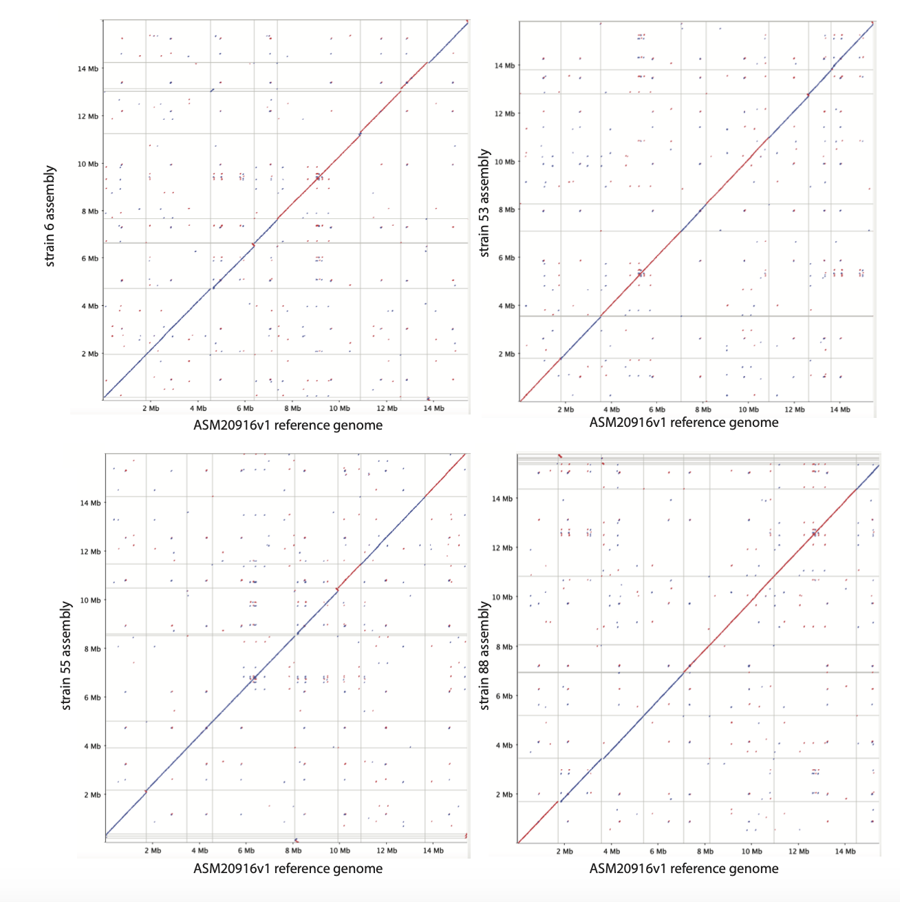
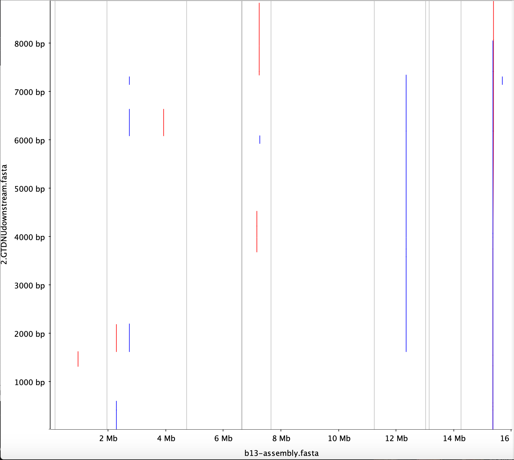
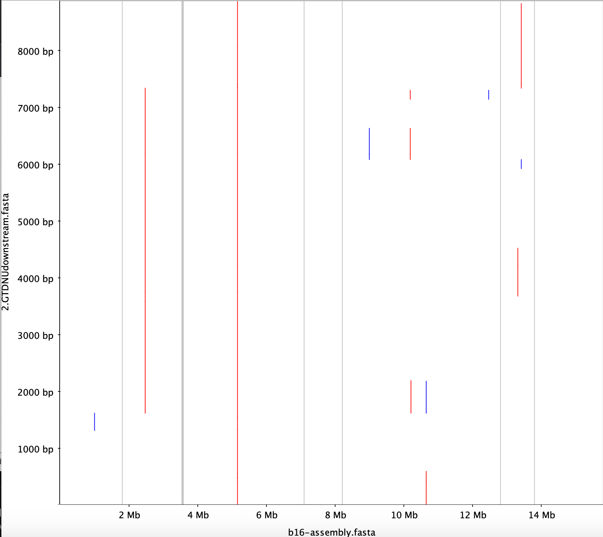
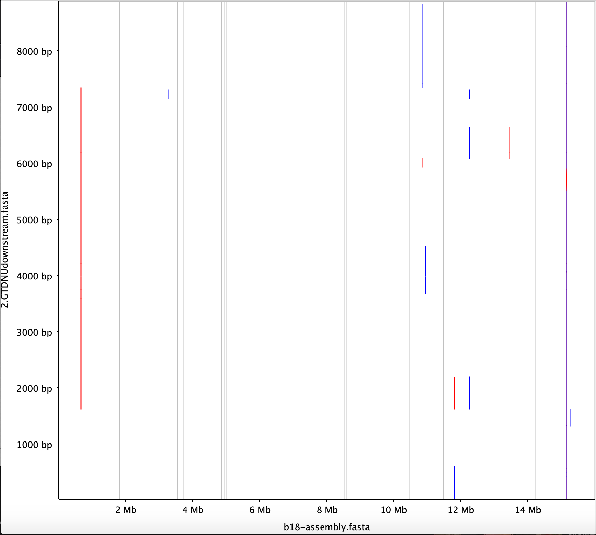

# Results

### Assembly

#### BUSCOs

| Insert | Complete BUSCOs (C) | Complete and single-copy BUSCOs (S) | Complete and duplicated BUSCOs (D) | Fragmented BUSCOs (F) | Missing BUSCOs (M) | Total BUSCO group searched |
| ---| ---|  ---| ---| ---| ---| ---|
| 6 | 687 (90.7%) | 685 (90.4%)| 2 (0.3%)| 6 (0.8%) | 65 (8.5%) | 758 |
|53| 681 (89.8%) | 680 (89.7%) | 1 (0.1%) | 7 (0.9%) | 70 (9.3%) | 758 |
| 59 | 685 (90.3%) | 681 (89.8%) | 4 (0.5%) | 7 (0.9%) | 66 (8.8%) | 758 |
| 88 | 678 (89.4%) | 677 (89.3%) | 1 (0.1%) | 6 (0.8%) | 74 (9.8%) | 758  |

#### Assembly stats

| insert | # of scaffolds| Total size of scaffolds | Longest scaffold | shortest scaffold | Number of scaffolds > 1M nt| Number of scaffolds > 100K nt|  Number of scaffolds > 10K nt | N50 | L50 | N90 | L90 |
|---|---| ---|---|---|---|---|---|---|---|---| --- |
|6 | 11| 16022515| 3579715| 16004|8| 10 | 11 | 1894960 | 3 | 1111997 | 7 |
| 53| 10 | 15787988 |  4587006| 4261 | 6| 7 | 8| 3523743| 2  | 1113568 | 6|
| 59 | 12 | 15994518 | 3515593 | 60343 |7| 9 | 12 | 1894562 | 3 | 1112789 | 7 |
| 88 | 23 | 15767318 | 3532437 | 2149 |7| 9 | 13 |1755085 | 3 | 1109753 | 7 |

### Rearrangement

We did not observe rearrangement in the assembled strains:
[dotplots in eps format](Notebook_Maryam/png/dotplots.eps)

### Insert locations

| strain | insert | insert location 2019 ref genome | number of inserts | insert location on 2007 genome | chromosome |
| --- | --- | --- | --- | --- |--- |
| 6 (b13) | 1.BSA4upstream | PQNB01000001.1 778685 |  1|NC_009042.1 1982553|Chromosome 2|
| 53 (b16)| 1.BSA4upstream | PQNB01000001.1 778195 | 1|NC_009042.1 1963057|Chromosome 2|
| 55 (b18)| 1.BSA4upstream | PQNB01000001.1 778685 | 1|NC_009042.1 1982553|Chromosome 2|
|88 (b19 )| 1.BSA4upstream | PQNB01000001.1 778195 | 1|NC_009042.1 1963058|Chromosome 2|
| | | | ||
| 6 (b13) | 2.GTDNUdownstream| PQNB01000023.1 107903 |  2 (different strands) |NC_009045.1 564770|chromosome 5|
| 53 (b16) | 2.GTDNUdownstream| PQNB01000019.1 593474|  1|NC_009068.1 1580399|chromosome 1|
| 55 (b18) | 2.GTDNUdownstream | PQNB01000022.1 615582 |2 (different strands)|NC_009044.1 891874|chromose 4|
| 88 (b19) | 2.GTDNUdownstream | PQNB01000028.1 440888 | 2 (same strand)|NC_009068.1 3058614|chromosome 1|

### Insert 2 locations and number of insertions based on the dotplot

