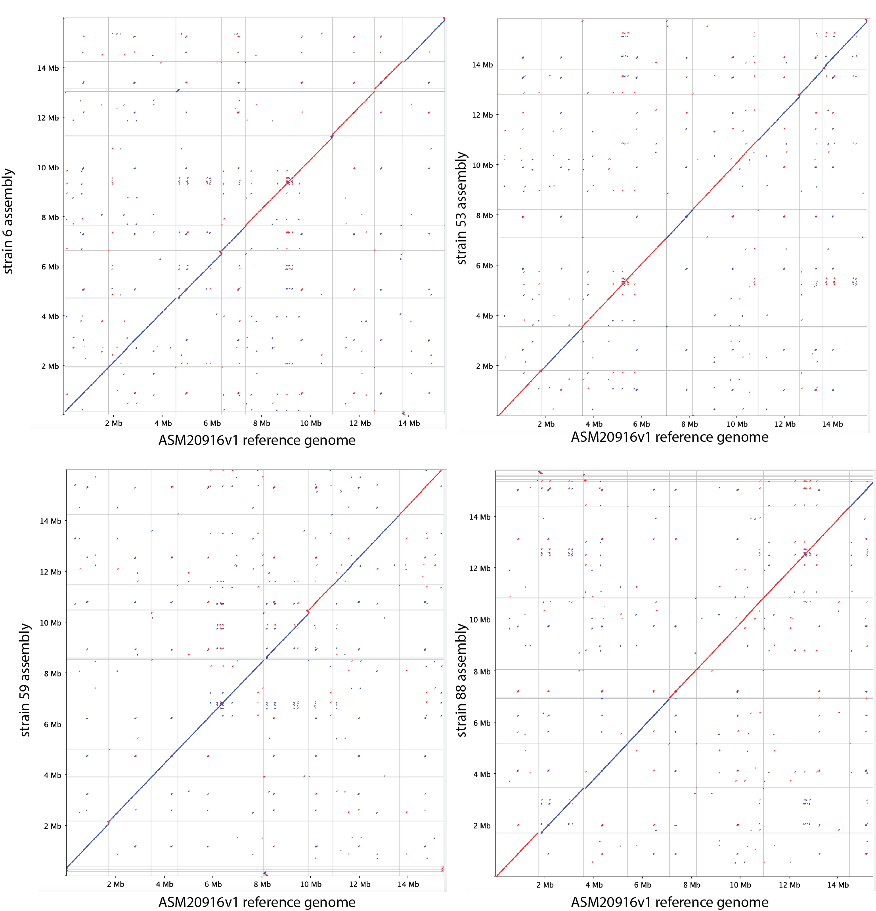

# Results

### Rearrangement

We did not observe rearrangement in the assembled strains:  
[dotplots in eps format](Notebook_Maryam/png/dotplots.eps)

### Insert locations

| strain | insert | insert location 2019 ref genome | number of inserts | insert location on 2007 genome | chromosome |
| --- | --- | --- | --- | --- |--- |
| 6 (b13) | 1.BSA4upstream | PQNB01000001.1 778685 |  1|NC_009042.1 1982553|Chromosome 2|
| 53 (b16)| 1.BSA4upstream | PQNB01000001.1 778195 | 1|NC_009042.1 1963057|Chromosome 2|
| 55 (b18)| 1.BSA4upstream | PQNB01000001.1 778685 | 1|NC_009042.1 1982553|Chromosome 2|
|88 (b19 )| 1.BSA4upstream | PQNB01000001.1 778195 | 1|NC_009042.1 1963058|Chromosome 2|
| | | | ||
| 6 (b13) | 2.GTDNUdownstream| PQNB01000023.1 107903 |  2 (different strands) |NC_009045.1 564770|chromosome 5|
| 53 (b16) | 2.GTDNUdownstream| PQNB01000019.1 593474|  1|NC_009068.1 1580399|chromosome 1|
| 55 (b18) | 2.GTDNUdownstream | PQNB01000022.1 615582 |2 (different strands)|NC_009044.1 891874|chromose 4|
| 88 (b19) | 2.GTDNUdownstream | PQNB01000028.1 440888 | 2 (same strand)|NC_009068.1 3058614|chromosome 1|

### Insert 2 locations and number of insertions based on the dotplot

