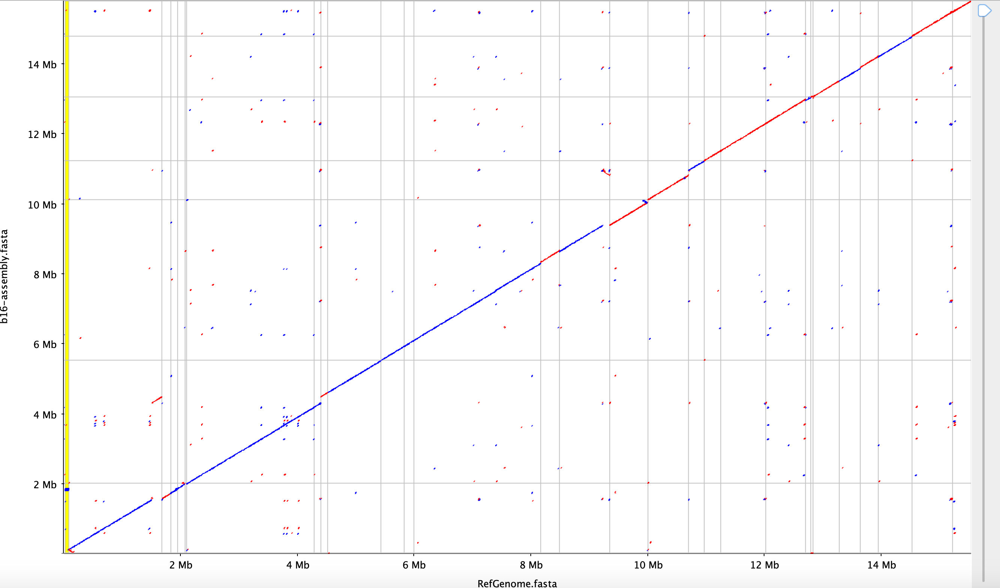

# Different inset one location with different methods

The purpose of this section is to try to find out why dotplot and alignment report different insert locations.

### Rearrangements

I am looking at insert 16 vs 2017 and 2007 reference genomes.

When comparing barcode 16 and 2007 ref genome, we first see some rearrangements:

But when I manually worked on aligning different sections I think I get a better alignment :

This makes more sense to me because we can clearly see that b16 and b13 align nicely to each other:

And alignment of barcode 13 vs reference genome did not show any rearrangements! (again I manually rearranged contigs for better fit)

So, I think the conclusion is at least in the contig level we can not confirm any large rearrangements for any of the strains!

## Insert location

I looked at the BUSCO score for the assemblies :

| Assembly | # missing BUSCOs | # scaffolds | total nucleotides| position of insert 1 on 2017 ref genome (Maryam) | position of insert 1 on 2017 ref genome (Siva) |
|---| ---| ---| ---|---|---|
| b13 | 65 |11 | 16,022,515 | PQNB01000001.1 778685| PQNB01000001.1:778189|
| b16 | 70 |10  | 15787988 | PQNB01000001.1 788195|PQNB01000001.1:1390811|
| b18 | 66 | 12 | 15994518 | PQNB01000001.1 778685|PQNB01000001.1:778203|
| b19 | 74 | 23 | 15767318 | PQNB01000001.1 788195|PQNB01000001.1:1390849|

I think for barcodes 16 and 19, the assembly is a little worse than barcode 13 and 18 ( from the slight increase in the number of missing BUSCOs). So the insertion location of insert 1 on these strains are different from each other among each method. I think that is why the histogram method provides the same location because it is based on the alignment of the reads on the reference genome not the assembly !

-----------
## Chromose information based on 2007 genome [ASM20916v1](https://www.ncbi.nlm.nih.gov/assembly/GCF_000209165.1)

Chromosome 1	CM000437.1	=	NC_009068.1
Chromosome 2	CP000496.1	=	NC_009042.1
Chromosome 3	CP000497.1	=	NC_009043.1
Chromosome 4	CP000498.1	=	NC_009044.1
Chromosome 5	CP000499.1	=	NC_009045.1
Chromosome 6	CP000500.1	=	NC_009046.1
Chromosome 7	CP000501.1	=	NC_009047.1
Chromosome 8	CP000502.1	=	NC_009048.1
