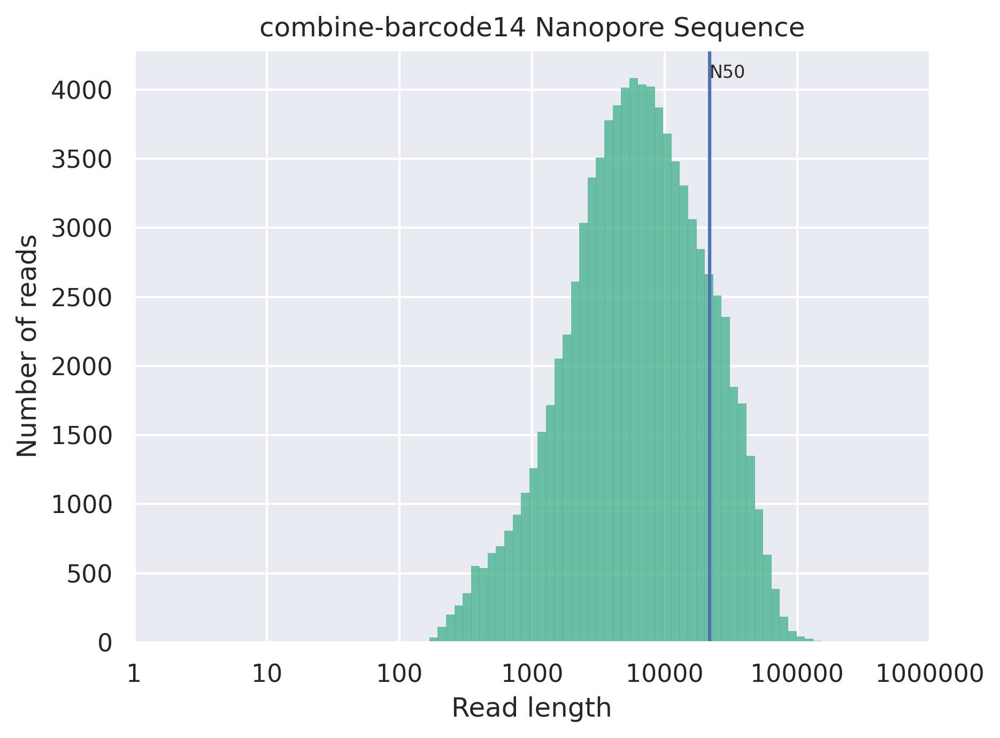
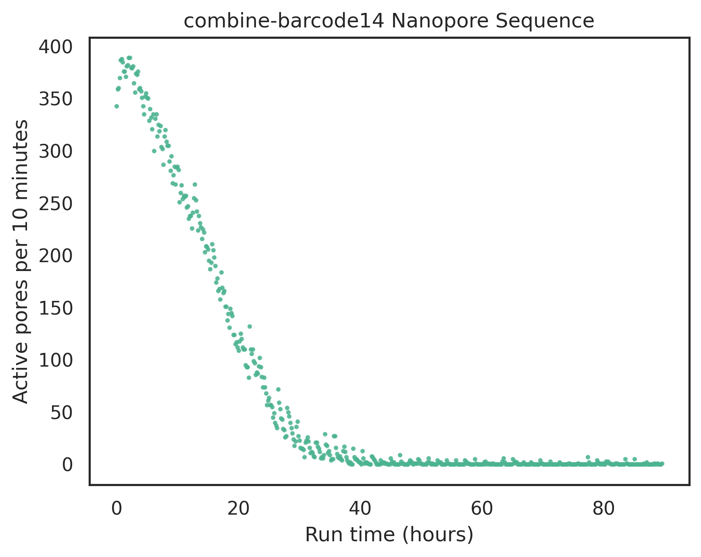

## Histogram of Number of Reads vs Read Length

## Histogram of Number of bases by read length

## Scatterplots of Average Quality vs Read Length

These data are plotted as a dotplot, hexplot and kdeplot.  The first plot is raw read length.  The second plot is log normalized read length.

### Dotplot Average Quality vs Read Length

### Hexplot Average Quality vs Read Length

### KDEplot Average Quality vs Read Length

## DotPlot of Yield by Read Length

## Active Pores over Time

## Reads per channel

## Cummulative Yield Plot in Gigabases

## CumulativeYieldPlot in number of reads

## Time vs Read Length Violin Plot

## Time vs log(Read Length) Violin Plot

## Time vs Read Quality Violin Plot

